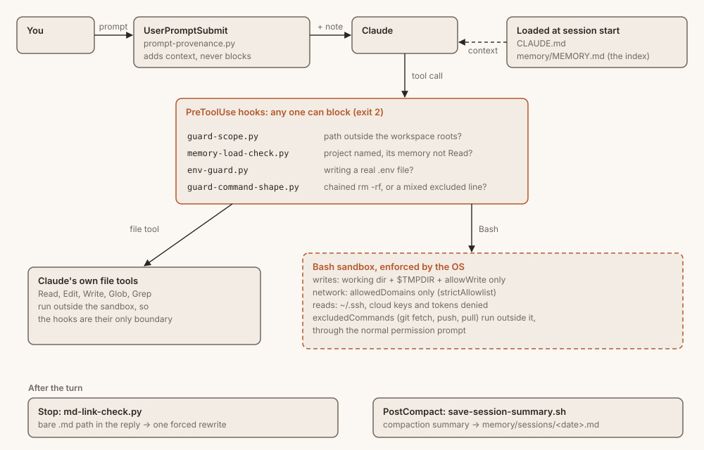
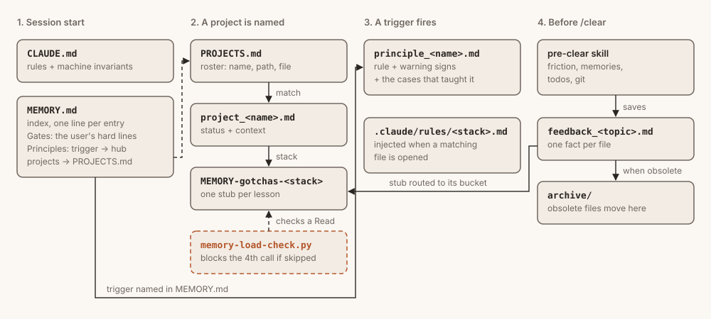

# Claude Code Starter

A reproducible Claude Code setup: layered memory that loads only when it's needed, hooks that keep the agent inside your workspace, an OS-level sandbox around its shell, and a pre-clear habit so nothing a session learned is lost. This is the wiring from a setup in daily use for months, with the personal content taken out.

Every piece has a reason, written down in **[WHY.md](WHY.md)**: what it prevents, and what you risk if you remove it.

## How it fits together

**A prompt, then a tool call.** Every tool call passes four hooks first. Claude's file tools then run directly, and Bash runs inside the sandbox. The sandbox wraps shell commands only, so the scope guard is the only fence around Read and Edit.

<picture>
  <source media="(prefers-color-scheme: dark)" srcset="docs/diagrams/request-path-dark.svg">
  
</picture>

**When memory loads.** Only `MEMORY.md` and `CLAUDE.md` load by themselves. Everything else waits for its moment: a project name, a principle's trigger, a matching file. `pre-clear` is what writes lessons back.

<picture>
  <source media="(prefers-color-scheme: dark)" srcset="docs/diagrams/memory-layers-dark.svg">
  
</picture>

## What you get

| | |
|---|---|
| **Memory** | An index (`MEMORY.md`) with Gates and Principles sections, 8 principle hubs, an example stack bucket, topic-file conventions, `archive/` |
| **7 hooks** | Scope guard, memory-load check, `.env` guard, command-shape guard, prompt provenance, clickable-link check, session-summary capture, with tests |
| **Sandbox** | Strict network allowlist, writes confined to the workspace and `$TMPDIR`, `~/.ssh` and tokens unreadable, `git` + read-only `gh` excluded |
| **4 skills** | `pre-clear`, `commit`, `prune`, `projects` |
| **Rules** | Path-scoped `.claude/rules/` examples (CSS, shell scripts), injected when a matching file opens |
| **Tooling** | `scripts/meta-health.sh` (memory rot), `scripts/projects.sh` (roster drift), templates for `PROJECTS.md` and workflow streams |
| **Docs** | `CLAUDE.md` with real example rules, [WHY.md](WHY.md), [HABITS.md](HABITS.md) |

## Install

Needs `python3`, `git`, and `jq` (for the session-summary hook). The sandbox runs on macOS, Linux and WSL2; on Linux install `bubblewrap` and `socat`.

```bash
git clone https://github.com/kapupasta/claude-code-starter ~/claude-code-starter
cd ~/claude-code-starter
./install.sh
```

Fork it first if you want your changes versioned under your own account. Your memory lives inside the repo, so **keep your fork private**.

**No terminal needed after this.** The Claude desktop app's Code tab reads the same `~/.claude` config as the terminal, so everything here works there too. Tested on macOS: the hooks fire, the sandbox blocks, and stepping outside it still asks you first. Install once from a terminal, then work wherever you like. (Claude Code on the web is different: it runs in a cloud machine and reads only what's committed to your repo, so none of this applies there.)

The installer:

1. Asks for your workspace root (`~/code`, `~/projects`, …).
2. Renames the placeholder memory folder to match.
3. Links `~/.claude/{settings.json,hooks,skills,rules}` and your memory folder into the repo. It refuses to replace a real (non-symlink) file or folder; back yours up first.
4. Writes `.claude/hooks/starter-config.json` with your paths. This is the one file every hook and script reads, and it's gitignored.
5. Copies `CLAUDE.md` and `PROJECTS.md` into your workspace, without overwriting.

## After install

1. Open Claude Code in your workspace and run `/sandbox` to check the sandbox started.
2. Edit `CLAUDE.md`: replace the **(example)** sections with your own.
3. Edit `memory/MEMORY.md`: your profile, your preferences, and which example gates and principles you keep.
4. List your projects in `PROJECTS.md`.
5. Add the hosts your work needs to `sandbox.network.allowedDomains`, and your credential files to `sandbox.credentials`.

Then use Claude normally, and run `/pre-clear` before every `/clear`. Memory builds up as you correct the agent; don't pre-fill it.

To regenerate the diagrams after editing them: `python3 docs/diagrams/build.py`.

## What this is not

- **Not your content.** The original setup has hundreds of lessons. Yours will come from your own mistakes, and they'll be better for it.
- **Not a plugin set.** Plugins are personal; install your own with `/plugin`.
- **Not mandatory.** Delete what doesn't fit. [WHY.md](WHY.md) tells you what each removal costs.

## Uninstall

```bash
rm ~/.claude/settings.json ~/.claude/hooks ~/.claude/skills ~/.claude/rules
rm ~/.claude/projects/<your-slug>
```

These are symlinks; the repo, and your memory inside it, stay untouched.

## License

MIT, see [LICENSE](LICENSE).
